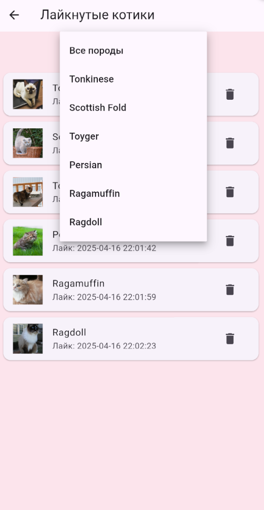

# Cat Tinder

**Cat Tinder** — это Flutter-приложение, позволяющее знакомиться с различными породами кошек в формате "свайптиндера". Пользователь может оценивать котиков с помощью свайпов или кнопок лайка/дизлайка, а также просматривать подробное описание породы на отдельном экране. Найдите своему котику пару!

---

## Функциональные возможности

Приложение реализует все требования первого домашнего задания, а также новые возможности:

- **Главный экран:**
  - **Случайное изображение котика с названием породы:**  
    При запуске приложения отображается случайное изображение кота, полученное с [The Cat API](https://thecatapi.com), и отображается название его породы.
  - **Свайп-контроль:**  
    Пользователь может свайпнуть изображение влево или вправо. Свайп вправо (или нажатие кнопки лайка) увеличивает счётчик лайков, а любой свайп – загружает нового котика.
  - **Кнопки лайка и дизлайка:**  
    На экране расположены две отдельные кнопки для оценки изображения.
  - **Навигация:**  
    При нажатии на изображение открывается детальный экран с полной информацией о породе.

- **Экран с детальным описанием:**  
  Показывает то же изображение кота и подробное описание породы (характеристики, темперамент, происхождение и прочее), полученное из API.

- **Новый экран лайкнутых котиков:**  
  - **Список избранных:**  
    Пользователь может перейти на экран, где в режиме рантайма хранится список всех лайкнутых котиков.
  - **Отображение карточки:**  
    Для каждого лайкнутого котика отображается изображение, порода и дата лайка.
  - **Удаление карточки:**  
    Реализована возможность удаления карточки из списка избранных.
  - **Фильтрация по породе:**  
    На экране избранных доступна фильтрация — через выпадающий список или поиск по породе. При выборе породы список мгновенно обновляется.

- **Обработка загрузки и ошибок:**  
  - При длительной загрузке изображений отображается `CircularProgressIndicator`.
  - В случае ошибки сети появляется диалоговое окно (AlertDialog) с уведомлением об ошибке.

---

## Технические детали

- **Интеграция с The Cat API:**  
  Приложение использует endpoint:  
  `https://api.thecatapi.com/v1/images/search?has_breeds=1&api_key=YOUR_API_KEY`  
  (API-ключ передается в запросе) и получает изображение кота только, если в ответе присутствует информация о породе.

- **Используемые пакеты и технологии:**
  - **http:** для выполнения HTTP-запросов.
  - **cached_network_image:** для загрузки и кэширования изображений.
  - **flutter_bloc (Cubit):** для управления состоянием экранов.
  - **get_it:** для внедрения зависимостей (Dependency Injection).
  - **Navigator:** для навигации между экранами.
  - **StatefulWidget** для главного экрана и **StatelessWidget** для компонентов кнопок.

- **Архитектура приложения:**  
  Проект реализован по принципам чистой архитектуры с разделением на:
  - **Data Layer:** работа с API и формирование моделей.
  - **Domain Layer:** бизнес-логика, сущности (Cat, LikedCat).
  - **Presentation Layer:** UI, экраны, управление состоянием через Cubit.

- **Дизайн и стиль:**
  - Приложению задан красивый розовый фон для улучшения визуального восприятия.
  - Реализована кастомная иконка, сгенерированная с помощью [flutter_launcher_icons](https://pub.dev/packages/flutter_launcher_icons).

- **Статический анализ и форматирование:**
  - Код отформатирован с помощью `dart format`.
  - Используются правила линтинга, настроенные через [flutter_lints](https://pub.dev/packages/flutter_lints) (файл `analysis_options.yaml` включает `package:flutter_lints/flutter.yaml`).
  - Статический анализ (`flutter analyze`) проходит без ошибок.

---

## Реализованные требования

### Функциональные требования:
1. **Главный экран** отображает случайное изображение котика и название его породы.
2. **Свайп-контроль:** изображение можно свайпать влево или вправо.
3. **Кнопки лайка и дизлайка:** отдельные компоненты для оценки изображения.
4. **Обновление данных:** свайп или нажатие на кнопки загружает нового котика.
5. **Счётчик лайков:** при лайке увеличивается счетчик.
6. **Навигация по нажатию на изображение:** открывается детальный экран с информацией о породе.
7. **Детальный экран:** отображает изображение котика и полное описание породы.
8. **Экран лайкнутых котиков:** список всех лайкнутых котиков, с отображением изображения, породы и даты лайка, возможностью удаления карточки и фильтрацией по породе.

### Технические требования:
1. Использован пакет **http** для запросов к [The Cat API](https://thecatapi.com).
2. Данные получаются через endpoint `/v1/images/search` с параметром `has_breeds=1` и API-ключом.
3. Изображение загружается только, если в ответе присутствует информация о породе.
4. Для отображения изображений используется виджет **CachedNetworkImage**.
5. Навигация между экранами выполняется с помощью **Navigator**.
6. Интерфейс составлен с использованием виджетов **Row** и **Column**.
7. Главный экран реализован как **StatefulWidget**, а кнопки — как **StatelessWidget**.
8. Реализована кастомная иконка приложения.
9. Приложение структурировано по принципам чистой архитектуры (Data, Domain, Presentation), управление состоянием осуществляется через Cubit, а внедрение зависимостей — через get_it.
10. Используется `CircularProgressIndicator` для отображения загрузки, а также `AlertDialog` для уведомления об ошибках сети.

---

## Интерфейс приложения

### Скриншоты

| Главный экран                           | Детальный экран                     |
|-----------------------------------------|-------------------------------------|
|        |  |

| Загрузка нового котика                  | Экран лайкнутых котиков             |
|-----------------------------------------|-------------------------------------|
|  |  |

| Фильтрация по породе                    |
|-----------------------------------------|
|   |

---

## Ссылка на скачивание APK

[Download Cat Tinder APK 1.0.0](https://drive.google.com/file/d/1tNPKbIzkfdqmuQJsSbGVEwRuHFDNv94H/view?usp=sharing)

---
